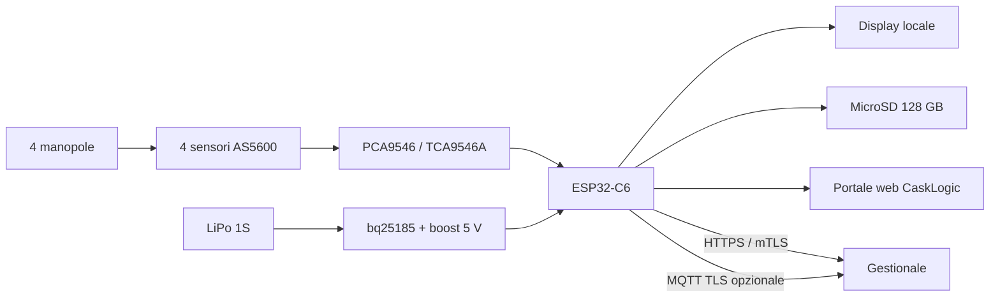

<p align="center">
  
</p>

<h1 align="center">Laveggio Printomatic</h1>

<p align="center">
  Gateway ESP32-C6 per la digitalizzazione non invasiva di un bilico meccanico
  Laveggio Printomatic del 1965.
</p>

<p align="center">
  
  
  
  
</p>

<p align="center">
  <a href="#-panoramica">Panoramica</a> ·
  <a href="#-funzioni">Funzioni</a> ·
  <a href="#-calibrazione-guidata">Calibrazione</a> ·
  <a href="#-hardware">Hardware</a> ·
  <a href="#-avvio-rapido">Avvio rapido</a> ·
  <a href="#-sicurezza">Sicurezza</a> ·
  <a href="#-documentazione">Documentazione</a>
</p>

---


## 🧭 Panoramica

Laveggio Printomatic legge quattro manopole meccaniche attraverso sensori
magnetici AS5600, ricostruisce il peso stabile e conserva lo storico su
microSD. La Waveshare ESP32-C6-LCD-1.47 espone un portale web CaskLogic per
calibrazione, diagnostica, manutenzione e integrazione con il gestionale.

Il sistema non altera la meccanica originale e mantiene sempre disponibile la
lettura locale. Il gestionale CaskLogic rimane un componente separato: questo
repository contiene firmware, simulatore, contratto di integrazione e
documentazione hardware.

> [!IMPORTANT]
> Firmware, portale, Wi-Fi, persistenza del display e aggiornamento OTA firmato
> sono stati verificati sull'ESP32-C6 reale. Restano da collaudare con l'hardware
> definitivo microSD FAT32, batteria, commutazione di alimentazione e rollback
> provocato da un'immagine non avviabile.

## ✦ Funzioni

| Area | Funzioni disponibili |
| --- | --- |
| **Acquisizione** | Quattro AS5600 isolati tramite PCA9546/TCA9546A, calibrazione di dieci posizioni per manopola, tolleranza, isteresi e stabilità |
| **Portale web** | Dashboard responsive, display remoto multipagina, calibrazione, storico filtrabile e ordinabile, sistema, assistenza CaskLogic e tema chiaro/scuro |
| **Storico** | Prime 20 pesate al caricamento, export coerente con i filtri, file NDJSON settimanali e retention configurabile su microSD |
| **Autodiagnosi** | Test di sensori, microSD, batteria, Wi-Fi, DNS, gestionale e heap; grafici 24 ore e contatori di errore per sensore |
| **Assistenza** | Pacchetto ZIP anonimizzato con stato, diagnostica, log e registro aggiornamenti |
| **Rete** | DHCP o IP statico, scansione Wi-Fi e access point di emergenza `LP-PW_casklogic-192_168_4_1` |
| **Integrazione** | HTTPS/mTLS, MQTT TLS opzionale, heartbeat, eventi firmati HMAC-SHA256, metriche Prometheus e configurazione remota versionata |
| **Aggiornamenti** | OTA firmato ECDSA-P256, doppia partizione, validazione al riavvio, rollback e registro degli esiti |

Il firmware non usa una coda persistente per gli eventi verso il gestionale e
non trasforma la microSD in un NAS.

## 🖥️ Pagine del portale

| Pagina | Cosa permette di fare |
| --- | --- |
| **Riepilogo** | Leggere peso, stabilità, stato dei quattro sensori, frequenza di scansione, Wi-Fi, microSD, alimentazione e batteria. Lo stato scelto per il display viene salvato e rispettato dopo ogni riavvio. |
| **Calibrazione** | Associare a ciascuna manopola le dieci posizioni `0–9`, salvare il valore magnetico reale e regolare moltiplicatore, tolleranza e isteresi senza ricompilare il firmware. |
| **Storico** | Consultare soltanto le 20 pesate più recenti al primo accesso, filtrare e ordinare ogni colonna ed esportare esattamente il risultato dei filtri attivi. |
| **Rete e gestionale** | Cercare reti Wi-Fi, scegliere DHCP o IP statico, configurare HTTPS/mTLS, HMAC, heartbeat, MQTT TLS e sincronizzazione controllata dal gestionale. |
| **Sistema** | Gestire display predefinito, NTP, fuso orario, credenziali, retention, dimensione dei file, batteria, log, riavvio e aggiornamento OTA firmato. Un clic breve su BOOT scorre le viste Peso, Sensori, Rete, Sistema e Gestionale; la pressione continua mostra la barra del ripristino da 10 secondi. |
| **Autodiagnosi** | Eseguire prove attive, controllare errori e magneti dei sensori, osservare i grafici giornalieri e scaricare un pacchetto assistenza anonimizzato. |
| **CaskLogic** | Consultare contatti di assistenza, titolarità, crediti, versione e informazioni legali del dispositivo. |

## 🎛️ Calibrazione guidata


Ogni sensore rappresenta una cifra della pesa. I valori predefiniti dei quattro
moltiplicatori sono `10.000`, `1.000`, `100` e `10 kg`; devono essere confermati
durante il collaudo meccanico reale.

### Procedura

1. Selezionare il sensore corrispondente alla manopola da calibrare.
2. Portare fisicamente la manopola sulla cifra `0`.
3. Verificare che **Qualità magnete** indichi `Regolare` e che il valore corrente
   sia stabile.
4. Premere il riquadro `0 · Memorizza`: il firmware salva in NVS il valore
   grezzo AS5600 letto in quell'istante.
5. Ripetere la stessa operazione per le posizioni da `1` a `9`.
6. Impostare moltiplicatore, tolleranza e isteresi, quindi premere
   **Salva parametri**.
7. Ripetere la procedura per tutti e quattro i sensori, fino a raggiungere
   `40/40 punti`.

Un singolo punto può essere rimemorizzato in qualsiasi momento cliccando di
nuovo la relativa cifra. **Azzera canale** elimina soltanto i dieci punti del
sensore selezionato e richiede conferma; non modifica gli altri canali.

| Parametro | Effetto |
| --- | --- |
| **Moltiplicatore kg** | Determina il contributo della cifra al peso totale: `posizione × moltiplicatore`. |
| **Tolleranza** | Distanza angolare massima tra lettura corrente e punto memorizzato affinché la cifra sia considerata valida. |
| **Isteresi** | Mantiene la posizione precedente entro una fascia aggiuntiva, evitando passaggi continui fra due cifre causati da vibrazioni o gioco meccanico. |
| **Finestra di stabilità** | Tempo durante il quale tutte le cifre devono restare invariate prima che la misura diventi una nuova pesata stabile. |

Il confronto usa la distanza circolare dell'AS5600, quindi gestisce
correttamente anche il passaggio fra `4095` e `0`. Se un magnete è assente,
troppo debole, troppo forte, fuori tolleranza o non calibrato, l'intera misura
rimane non valida e non viene registrata come nuova pesata.

## ⚙️ Dalla lettura alla pesata

1. Il multiplexer interroga continuamente i quattro AS5600 a `100 kHz`.
2. Ogni valore grezzo viene confrontato con i dieci punti del proprio canale.
3. Tolleranza e isteresi determinano la cifra riconosciuta senza oscillazioni.
4. Le quattro cifre vengono moltiplicate e sommate per ottenere i chilogrammi.
5. La combinazione deve restare invariata per la finestra di stabilità.
6. Solo una combinazione valida, stabile e diversa dalla precedente genera una
   nuova riga nello storico e un evento firmato verso il gestionale.

La microSD conserva lo storico indipendentemente dalla connessione di rete, ma
non viene usata come coda automatica di reinvio.

## 📊 Autodiagnosi


La corrente assorbita è indicata come non disponibile perché il bq25185 non
fornisce telemetria amperometrica. Tensione batteria, temperatura del chip,
RSSI e memoria libera sono invece registrabili senza aggiungere altre schede.

## 🧩 Architettura



## 🔩 Hardware

| Componente | Quantità | Riferimento |
| --- | ---: | --- |
| Waveshare ESP32-C6-LCD-1.47 | 1 | [Amazon.it · B0DHTMYTCY](https://www.amazon.it/dp/B0DHTMYTCY) |
| Adafruit PCA9546 / TCA9546A STEMMA QT | 1 | [Amazon.it · B0BSG8KX8L](https://www.amazon.it/dp/B0BSG8KX8L) |
| Kit moduli AS5600 a 12 bit con magneti | 1 kit | [Amazon.it · B0FH1Y3GLG](https://www.amazon.it/dp/B0FH1Y3GLG) |
| Cavetti micro JST-SH 1,0 mm, 4 pin | 1 confezione | [Amazon.it · B0BNCHC5Q4](https://www.amazon.it/dp/B0BNCHC5Q4) |
| **Adafruit bq25185 USB/DC/Solar Charger con boost 5 V, PID 6106** | **1** | **[Amazon.it · B0DXK6YZX8](https://www.amazon.it/dp/B0DXK6YZX8)** |
| Batteria LiPo AFTERTECH 103040, 1200 mAh | 1 | Polarità JST-PH da verificare prima del collegamento |
| MicroSD FAT32 | 1 | 128 GB installata |

Il modulo bq25185 acquistato è la versione con boost TPS61023 a 5 V: non serve
un convertitore step-up separato. Collegamenti e verifiche elettriche sono
descritti in [`docs/power-and-ups.md`](docs/power-and-ups.md).

## 🚀 Avvio rapido

### Simulatore web

```powershell
cd firmware/production-gateway
npm test
npm run simulate
```

Il portale risponde su `http://127.0.0.1:4177`. Il simulatore usa gli stessi
file HTML, CSS e JavaScript incorporati nel firmware.

### Build ESP32-C6

```powershell
cd firmware/production-gateway
$env:PLATFORMIO_CORE_DIR = 'C:\pio'
py -m platformio run
```

| Risorsa | Utilizzo verificato |
| --- | ---: |
| RAM statica | `51.124 / 327.680 byte` · `15,6%` |
| Flash applicazione | `1.701.906 / 2.031.616 byte` · `83,8%` |
| Immagine OTA firmata | `1.761.136 byte` |
| Margine per slot OTA | `263.392 byte` · `13,0%` |

Artefatti principali:

- `firmware.signed.bin`: aggiornamento accettato dal portale OTA;
- `firmware.factory.bin`: prima installazione completa, inclusa la tabella
  partizioni;
- `firmware.bin`: input non firmato, non caricabile dal portale.

## 🛡️ Sicurezza

<p>
  
  
  
  
</p>

- autenticazione HTTP Basic, rate limit, CSRF e header browser restrittivi;
- endpoint remoti esclusivamente TLS con CA obbligatoria e mTLS opzionale;
- segreto HMAC distinto per la firma delle pesate;
- token dedicato per `GET /api/metrics`;
- configurazione remota limitata a una whitelist di campi operativi;
- chiave privata OTA esterna al repository;
- pacchetto assistenza senza credenziali, SSID o indirizzi IP.

Il portale locale usa HTTP e deve restare su una VLAN tecnica, senza port
forwarding verso Internet. Secure Boot e Flash Encryption tramite eFuse
richiedono provisioning fisico irreversibile sulla scheda reale. Dettagli in
[`docs/security.md`](docs/security.md) e
[`docs/firmware-signing.md`](docs/firmware-signing.md).

## 🗂️ Struttura

| Percorso | Contenuto |
| --- | --- |
| [`firmware/production-gateway`](firmware/production-gateway/) | Gateway operativo ESP32-C6 e simulatore web |
| [`firmware/calibration-reader`](firmware/calibration-reader/) | Firmware diagnostico usato nelle prime prove hardware |
| [`docs`](docs/) | Cablaggio, alimentazione, sicurezza, test e contratto gestionale |
| [`stl`](stl/) | Case e supporti stampabili in 3D con licenze separate |

## 📚 Documentazione

- [Hardware e distinta materiali](docs/hardware.md)
- [Cablaggio dei sensori](docs/wiring.md)
- [Batteria, caricatore e boost 5 V](docs/power-and-ups.md)
- [Architettura operativa](docs/production-architecture.md)
- [Sicurezza del gateway](docs/security.md)
- [Firma e rilascio firmware](docs/firmware-signing.md)
- [Contratto futuro con CaskLogic](docs/casklogic-integration-contract.md)
- [Prompt per implementare il lato gestionale](docs/casklogic-integration-prompt.md)
- [Risultati delle verifiche](docs/test-results.md)

## Stato del progetto

- [x] Lettura AS5600 e multiplexer verificata sul prototipo
- [x] Gateway, portale web e simulatore implementati
- [x] Test host `21/21` e build ESP32-C6 completati
- [x] OTA firmato verificato sull'hardware e doppia partizione con margine del `13,3%`
- [x] Wi-Fi del sito e persistenza del display verificati dopo riavvio
- [ ] Calibrazione meccanica completa delle quattro manopole
- [ ] Collaudo reale di microSD FAT32, batteria, commutazione e rollback forzato
- [ ] Implementazione del contratto nel gestionale CaskLogic

## Licenza e attribuzioni

Il codice e la documentazione sono distribuiti con licenza
[Creative Commons Attribution 4.0 International](LICENSE), salvo indicazioni
diverse nei singoli file. È richiesta l'attribuzione a **Piero Borgatta** e ai
contributori del progetto.

Gli STL di terzi mantengono licenza e attribuzione originali, documentate in
[`THIRD_PARTY_NOTICES.md`](THIRD_PARTY_NOTICES.md).

<p align="center">
  <strong>CaskLogic Solutions</strong><br>
  Laveggio Printomatic · preservare la meccanica, rendere misurabile il dato
</p>
