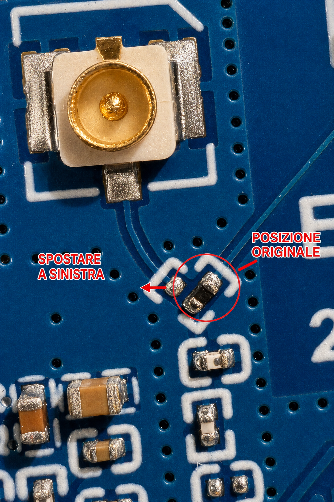

# Cablaggio

## Schema logico

```text
USB-C oppure LiPo 3,7 V
          |
          v
Waveshare ESP32-S3-Touch-LCD-2.8
  3V3  --------+------- VIN   PCA9546 Adafruit 5663
               +------- distribuzione VCC agli AS5600 #0-#3
  GND  --------+------- GND          |
               +------- distribuzione GND agli AS5600 #0-#3
  GPIO11 (SDA) -------- SDA          +-- SD0/SC0 -- AS5600 #0 SDA/SCL
  GPIO10 (SCL) -------- SCL          +-- SD1/SC1 -- AS5600 #1 SDA/SCL
                                      +-- SD2/SC2 -- AS5600 #2 SDA/SCL
                                      +-- SD3/SC3 -- AS5600 #3 SDA/SCL

Per ciascun canale: SDn -> SDA e SCn -> SCL. VCC e GND arrivano dalla
distribuzione comune e non vengono commutati dal multiplexer.
AS5600: DIR, GPO e OUT non collegati nella lettura I2C standard.
```

## Scheda verso multiplexer

| Waveshare ESP32-S3 | Multiplexer | Nota |
| --- | --- | --- |
| 3V3 | VIN | Alimentare allo stesso livello logico della Waveshare |
| GND | GND | Massa comune obbligatoria |
| GPIO11 | SDA | Bus esterno dedicato dal firmware |
| GPIO10 | SCL | Bus esterno dedicato dal firmware |
| GPIO18 | RST, opzionale | Collegare solo se si vuole il reset pilotato |

Il multiplexer funziona anche con il solo cablaggio a quattro fili se il suo
RST è già mantenuto alto dalla scheda. GPIO18 viene predisposto alto dal
firmware, ma non agisce se non è collegato fisicamente.

## Attenzione ai colori dei cavetti

Sul prototipo precedente alcuni connettori specchiavano l'ordine dei fili. Il
colore non identifica il segnale. Prima di alimentare:

1. scollegare USB-C e batteria;
2. leggere VIN, GND, SDA e SCL sulle serigrafie;
3. verificare ogni filo con il multimetro in continuità;
4. escludere corti tra VIN e GND;
5. collegare un solo AS5600 e verificare `0x70` e `0x36`;
6. aggiungere gli altri rami uno alla volta.

SDA/SCL invertiti impediscono la comunicazione; VCC/GND invertiti possono
danneggiare i componenti. Display, touch, audio, RTC, IMU e microSD sono già
cablati sulla Waveshare e non devono essere riportati sul bus esterno.

## Antenna Wi-Fi esterna

Il pigtail IPEX-1/U.FL verso SMA femmina si accoppia all'antenna 2,4 GHz con SMA
maschio. Il connettore IPEX1 della Waveshare non diventa attivo con il solo
inserimento del cavetto. Sul montaggio realizzato è stato necessario spostare
a sinistra la resistenza di selezione RF dalla posizione originale, usando un
saldatore ad aria calda e il flussante.



La fotografia mostra la resistenza **prima** della modifica: va spostata sul
pad immediatamente a sinistra indicato dalla freccia. Eseguire l'intervento a
scheda disalimentata, proteggere il connettore IPEX1 dal calore, lasciare
raffreddare e verificare con lente o microscopio l'assenza di ponti di stagno
prima di ricollegare batteria e USB-C.

## Cavo dei sensori

Il Lapp LiYY 4 x 0,14 mm2 è un cavo a quattro conduttori non schermato. Usare un
conduttore per ciascuno dei segnali `3V3`, `GND`, `SDA` e `SCL`, mantenendo ogni
ramo quanto più corto possibile. I 10 m indicano la quantità acquistata, non la
lunghezza ammessa per una singola tratta I2C. Prima del montaggio definitivo
provare ogni spezzone a 100 kHz e ridurre frequenza o lunghezza se le letture non
sono affidabili.
